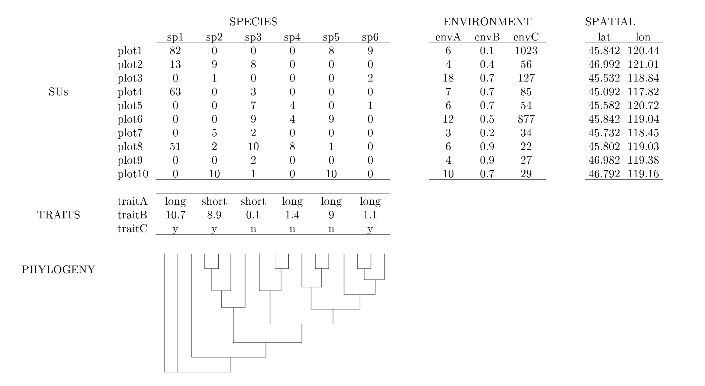

class: inverse middle center big-subsection

```{r setup, include=FALSE, cache=FALSE}
options(htmltools.dir.version = FALSE)
knitr::opts_chunk$set(cache = FALSE, dev = 'svg', echo = TRUE, 
                      eval = FALSE, message = FALSE, warning = FALSE, 
                      fig.height = 6, fig.width = 1.777777*6,
                      strip.white = FALSE)
`get_palette` <- function() {
  pal <- c('#414487E6','#404688E6','#3F4889E6','#3E4989E6','#3E4C8AE6',
           '#3D4E8AE6','#3C508BE6','#3B528BE6','#3A548CE6','#39558CE6',
           '#38588CE6','#375A8CE6','#365C8DE6','#355E8DE6','#35608DE6',
           '#34618DE6','#33638DE6','#32658EE6','#31678EE6','#30698EE6',
           '#306A8EE6','#2F6C8EE6','#2E6E8EE6','#2D708EE6','#2C718EE6',
           '#2C738EE6','#2B748EE6','#2A768EE6','#2A788EE6','#297A8EE6',
           '#287C8EE6','#287D8EE6','#277F8EE6','#26818EE6','#26828EE6',
           '#25848EE6','#24868EE6','#24878EE6','#23898EE6','#228B8DE6',
           '#228D8DE6','#218F8DE6','#21908CE6','#20928CE6','#20938CE6',
           '#1F958BE6','#1F978BE6','#1F998AE6','#1F9A8AE6','#1E9C89E6',
           '#1F9E89E6','#1FA088E6','#1FA187E6','#20A386E6','#20A486E6',
           '#21A685E6','#22A884E6','#24AA83E6','#25AC82E6','#26AD81E6',
           '#28AE80E6','#2AB07FE6','#2DB27DE6','#2FB47CE6','#32B67AE6',
           '#34B679E6','#37B878E6','#3ABA76E6','#3DBC74E6','#40BD72E6',
           '#43BF71E6','#47C06FE6','#4AC16DE6','#4EC36BE6','#52C569E6',
           '#55C668E6','#59C864E6','#5DC863E6','#60CA60E6','#65CB5EE6',
           '#68CD5BE6','#6DCD59E6','#71CF57E6','#75D054E6','#7AD151E6',
           '#7FD34EE6','#83D44CE6','#87D549E6','#8CD646E6','#90D743E6',
           '#95D840E6','#9AD93CE6','#9FDA3AE6','#A3DA37E6','#A8DB34E6',
           '#ADDC30E6','#B2DD2DE6','#B7DE2AE6','#BBDF27E6')
  return(pal)
}
`colvec` <- function(x) {
  pal <- get_palette()
  return(pal[cut(as.numeric(x), breaks=length(pal), include.lowest=TRUE)])
}
```

# Good afternoon!

---
class: inverse middle center big-subsection

# Overview

---

# Overview

.pull-left[
### You want to:

- Count species or turnover

- Visualize species patterns among SUs 

- Group SUs by species differences 

- Test species differences among SUs 

- Evaluate env-species 

- Evaluate trait-env-species 

- Evaluate phylogeny-trait-env-species 

- Evaluate spatial-phylogeny-trait-env-species 
]

--

.pull-right[
### You can use:

- Diversity measures 

- Ordination 

- Clustering 

- Hypothesis testing

- Hypothesis testing, overlays

- CWM, fourth corner 

- Phylogenetic community methods 

- Advanced community methods
]

---

# Software installation

1\. Download and install R from: https://cran.r-project.org/  

2\. Optional: download and install Rstudio from: https://posit.co/download/rstudio-desktop/

3\. Install packages (only once!)  

```{r pkg-load-01, eval = FALSE}
pkg <- c('vegan', 'labdsv', 'ade4', 'ecodist', 'ape', 'picante')
install.packages(pkg)
```

4\. Load packages  

```{r pkg-load-02, eval = FALSE}
sapply(pkg, require, character.only = TRUE)
```
    
```{r pkg-load-03, eval = TRUE, echo = FALSE}
pkg <- c('vegan', 'labdsv', 'ade4', 'ecodist', 'ape', 'picante')
snk <- capture.output(sapply(pkg, require, character.only = TRUE))
```

5\. Load some utility functions  

```{r source-utils, eval = FALSE}
source("https://github.com/phytomosaic/esa2022/raw/main/R/utils_color.R")
```

---

# Get the data

```{r get-dataset-gh, eval=FALSE}
u <- 'https://github.com/phytomosaic/esa2023/raw/main/data/veg.rda'
u <- url(u)
load(u)
```

---
# Basic R syntax

```{r basic-syntax}
### assignment
x <- 10                                # objects: a scalar
m <- matrix(c(1:8,NA), nrow=3, ncol=3) # objects: a 3x3 matrix
f <- function(a, b) { a + b }          # functions
e <- new.env()                         # environments

### object structure
str(x)                                 # describe structure
head(x)                                # peek at top few rows

### indexing values in an object
m[1,1]                                 # matrix row 1, column 1
lst$the_name                           # list item by name (data.frame column)

### replacing pesky values
m[is.na(m)] <- 777                     # assign value to any missing values
```

---

# The Matrix



---

# The data

### Mafragh, Algeria vegetation data

We will use one core dataset throughout this tutorial. The `veg` dataset gives information about spatial coordinates, species, environment, traits, and phylogeny for plants on the Mafragh coastal plain in North Africa. 

Specifically, `veg` is a list containing five items:

- `xy`  97 observations of 2 spatial coordinates
- `spe` 97 observations of 56 plant species
- `env` 97 observations of 11 soil environmental variables
- `tra` 12 traits for 56 plant species
- `phy` phylogeny for 56 plant species

---

# Load data

```{r load-data, eval=TRUE}
load('./data/veg.rda')  # load the object (contains multiple objects)
xy  <- veg$xy           # spatial
spe <- veg$spe          # species
env <- veg$env          # environment
tra <- veg$tra          # traits
phy <- veg$phy          # phylogeny
rm(veg)                 # cleanup
ls()                    # list objects now in this local environment
```

--
<br></br>
#### How would you examine what's inside one of these objects?

---
class: inverse middle center big-subsection

# Transformations

---

# Transformations

```{r transf-spe, eval=TRUE}
### Species: express abundances as 0/1 presence/absence
# (spe > 0) * 1

### Species: express abundances on log10 scale
spe <- data.frame(log10(spe + 1))

### Environment: express variables in [0,1] range
env <- data.frame(vegan::decostand(env, 'range'))

### Traits: express traits in [0,1] range 
tra <- data.frame(vegan::decostand(tra, 'range'))
```

--

#### Why do we transform community data?

---
class: inverse middle center big-subsection

# Outliers

---

# Outliers

#### Define multivariate outlier function

```{r outl-define, eval=TRUE}
`outliers` <- function (x, mult=2, method='bray') {
    d       <- as.matrix(vegan::vegdist(x, method=method, binary=F, diag=T, upper=T))
    diag(d) <- as.numeric(1)     # avoid zero-multiplication
    m       <- apply(d, 2, mean) # site means
    z       <- scale(m)          # z-scores
    data.frame(mean_dist = m, z = z, is_outlier = abs(z) >= mult)
}
```

--

```{r outl-use, eval=TRUE}
o <- outliers(spe, mult=2)
head(o, 3)
which(o$is_outlier)
```

---

# Test validity of species matrix

Species matrix must have no missings, no empty SUs, no empty species. 

```{r tst-na}
!anyNA(spe)                    # expect TRUE, no missing values

all(rowSums(spe, na.rm=T) > 0) # expect TRUE, no empty sites

all(colSums(spe, na.rm=T) > 0) # expect TRUE, no empty species
```
  
---

# Visualize data

.pull-left.w50[
```{r plot-data-01, eval = FALSE}
### spatial
plot(xy, pch=19, col='grey') #<<

### species
vegan::tabasco(spe, col=get_palette())

### environment
vegan::tabasco(env, col=get_palette())

### traits
vegan::tabasco(tra, col=get_palette())

### phylogeny
plot(phy, cex=0.6, no.margin=TRUE)
```
]

.pull-right.w50[
```{r plot-data-02, eval = TRUE, echo = FALSE, fig.height = 5.75, fig.width = 5.75}
par(mfrow=c(1,1), las=1, oma=c(0,0,0,0), mar=c(2.7,2.2,1.1,0.4),
    bty='L', mgp=c(1.4,0.3,0), tcl=0.2, pty='s')
plot(xy, pch=19, col='grey', xlab='Easting', ylab='Northing',
     main='Map of sites in study area')
```
]

---

# Visualize data

.pull-left.w50[
```{r plot-data-03, eval = FALSE}
### spatial
plot(xy, pch=19, col='grey')

### species
vegan::tabasco(spe, col=get_palette()) #<<

### environment
vegan::tabasco(env, col=get_palette())

### traits
vegan::tabasco(tra, col=get_palette())

### phylogeny
plot(phy, cex=0.6, no.margin=TRUE)
```
]

.pull-right.w50[
```{r plot-data-04, eval = TRUE, echo = FALSE, fig.height = 5.75, fig.width = 5.75}
vegan::tabasco(spe, col=get_palette())
```
]

---

# Visualize data

.pull-left.w50[
```{r plot-data-05, eval = FALSE}
### spatial
plot(xy, pch=19, col='grey')

### species
vegan::tabasco(spe, col=get_palette())

### environment
vegan::tabasco(env, col=get_palette()) #<<

### traits
vegan::tabasco(tra, col=get_palette())

### phylogeny
plot(phy, cex=0.6, no.margin=TRUE)
```
]

.pull-right.w50[
```{r plot-data-06, eval = TRUE, echo = FALSE, fig.height = 5.75, fig.width = 5.75}
vegan::tabasco(env, col=get_palette())
```
]

---

# Visualize data

.pull-left.w50[
```{r plot-data-07, eval = FALSE}
### spatial
plot(xy, pch=19, col='grey')

### species
vegan::tabasco(spe, col=get_palette())

### environment
vegan::tabasco(env, col=get_palette())

### traits
vegan::tabasco(tra, col=get_palette()) #<<

### phylogeny
plot(phy, cex=0.6, no.margin=TRUE)
```
]

.pull-right.w50[
```{r plot-data-08, eval = TRUE, echo = FALSE, fig.height = 5.75, fig.width = 5.75}
vegan::tabasco(tra, col=get_palette())
```
]

---

# Visualize data

.pull-left.w50[
```{r plot-data-09, eval = FALSE}
### spatial
plot(xy, pch=19, col='grey')

### species
vegan::tabasco(spe, col=get_palette())

### environment
vegan::tabasco(env, col=get_palette())

### traits
vegan::tabasco(tra, col=get_palette())

### phylogeny
plot(phy, cex=0.6, no.margin=TRUE) #<<
```
]

.pull-right.w50[
```{r plot-data-10, eval = TRUE, echo = FALSE, fig.height = 5.75, fig.width = 5.75}
plot(phy, cex=0.6, no.margin=TRUE)
```
]

---
class: inverse middle center big-subsection

# Diversity

---

# Diversity measures

#### How do you define "diversity"?  

```{r div-01, eval = TRUE, echo = TRUE}
### Gamma (regional) diversity
(gamma <- sum(colSums(spe) > 0))
```

```{r div-02, eval = TRUE, echo = TRUE}
### Alpha (per-site) diversity
alpha <- rowSums(spe > 0)  # within-site
(avgalpha <- mean(alpha))  # average within-site
```

```{r div-03, eval = TRUE, echo = TRUE}
### Beta (among-site) diversity: Whittaker's
(beta <- gamma / avgalpha - 1)
```

---

# Diversity measures (&#x3B2;-diversity)

```{r div-04, eval = TRUE, echo = TRUE}
### 1 -- proportion of zeros in the matrix (independent of abundance)
propzero <- sum(spe < .Machine$double.eps) / prod(dim(spe))
cat('Proportion of zeros in matrix:', propzero, '\n')
```

```{r div-05, eval = TRUE, echo = TRUE}
### 2 -- "dust bunny index" of McCune and Root (2015) (uses abundances)
dbi <- 1 - mean(as.matrix(vegan::decostand(spe, method='max')))
cat('Dust bunny index:', dbi, '\n')
```

```{r div-06, eval = TRUE, echo = TRUE}
### 3 -- pairs of SUs that don't share species
z <- vegan::no.shared(spe)
propnoshare <- sum(z) / length(z)
cat('', propnoshare, 'proportion of site-pairs share no species in common\n')
```

---
class: inverse middle center big-subsection

# Dissimilarities

---

#    Dissimilarities

.pull-left.w48[
#### Species
```{r diss-01, eval = TRUE, echo = TRUE, fig.height = 5.0, fig.width = 5.0}
d <- vegdist(spe, method='bray', binary=T)
tabasco(as.matrix(d), col=get_palette())
```
]

.pull-right.w48[
#### Environment
```{r diss-03, eval = TRUE, echo = TRUE, fig.height = 5.0, fig.width = 5.0}
E <- vegdist(env, method='euc', binary=F)
tabasco(as.matrix(E), col=get_palette())
```
]

---

# Loss of sensitivity problem

.pull-left.w60[
How dissimilar are SUs A and C? They share no species in common...
```{r double-zero-01, eval = TRUE, echo = FALSE}
m <- data.frame(matrix(c(1,1,0,0,0, 0,1,1,1,0, 0,0,0,1,1), nrow=3, byrow=T), 
                row.names=paste0('su',c('A','B','C')))
names(m) <- paste0('sp',1:5)
m
```
]

--

.pull-left.w60[
...Bray-Curtis will max out at 1.0...
```{r double-zero-03, eval = TRUE, echo = FALSE}
vegdist(m, 'bray')
```
]

--

.pull-left.w60[
...but `stepacross()` replaces "too long" distances with shortest path.
```{r double-zero-04, eval = TRUE, echo = FALSE}
s <- capture.output(sa <- stepacross(vegdist(m, 'bray'))) ; sa
```
]

---

# Stepacross adjustment

```{r double-zero-05, eval = TRUE, echo = FALSE, fig.height = 5.9, fig.width = 5.9, fig.align = 'center'}
# par(mar=c(2,2,0,0), pty='m', bty='L')
# s <- scores(data.frame(x=c(0,0.5,1.0), y=c(0,0.3316625,0)))
# # s <- vegan::scores(as.matrix(data.frame(x=c(0,0.5,1.0), y=c(0,0.3316625,0))))
# plot(s, asp=1, ylab='',xlab='')
# arrows(0,0,0.5,0.3316625, lwd=4, angle=15, col='#1034A9')
# arrows(0.5,0.3316625,1,0, lwd=4, angle=15, col='#1034A9')
# arrows(0,0,1,0, lwd=4, angle=15, col='#a91034')
# ordilabel(s, labels=c('A','B','C'), cex=1.2)
# text(scores(data.frame(x=c(0.23,0.50,0.77), y=c(0.2,-0.045,0.2))), 
#           labels=c('0.6','1.2','0.6'), adj=0.5)
par(mar=c(2,2,0,0), pty='m', bty='L')
s <- data.frame(x=c(0,0.5,1.0), y=c(0,0.3316625,0))
plot(s, asp=1, ylab='',xlab='')
arrows(0,0,0.5,0.3316625, lwd=4, angle=15, col='#1034A9')
arrows(0.5,0.3316625,1,0, lwd=4, angle=15, col='#1034A9')
arrows(0,0,1,0, lwd=4, angle=15, col='#a91034')
points(s, pch=22, fg='black', bg='white', cex=2.75)
text(s, labels = LETTERS[1:3], cex=1.2)
text(data.frame(x=c(0.23,0.50,0.77), y=c(0.2,-0.045,0.2)), 
	 labels=c('0.6','1.2','0.6'), adj=0.5)
```

---

# Stepacross adjustment


```{r diss-01-visible-code, eval = FALSE}
D <- stepacross(d, 'shortest', toolong = 1)
plot(d, D, xlab = 'Original', ylab = 'Stepacross')
```

```{r diss-02-invisible-eval, eval = TRUE, echo = FALSE, fig.height = 5.0, fig.width = 5.0, fig.align = 'center'}
snk <- capture.output(D <- stepacross(d, 'shortest', toolong = 1))
par(pty='s', las=1, oma=c(0,0,0,0), mar=c(3.1,3.1,0.1,0.1), bty='L', mgp=c(2,0.3,0), tcl=0.2)
plot(d, D, xlab = 'Original', ylab = 'Stepacross') 
abline(0, 1, col='red', lwd=1.0)
```


---
class: inverse middle center big-subsection

# Ordination

---

# Ordination: unconstrained

### Three different algorithms
```{r ord-unconstrained-01, eval = TRUE, echo = TRUE}
m1 <- metaMDS(D, k=2, maxit=250, try=100, trymax=101, trace=0) # NMS
m2 <- cmdscale(D, k=2, add=T)                                  # PCoA
m3 <- prcomp(spe)                                              # PCA
```

```{r ord-unconstrained-02, eval = TRUE, echo = FALSE, fig.height = 4.5, fig.width = 12.0}
### Visualizing ordinations
# color vector for plotting
u <- get_palette()
u <- u[1:nrow(spe)]
# compare three kinds of ordination
par(mfrow=c(1,3), bty='l', las=1)
plot(m1$points, type='n', xlab='NMDS1', ylab='NMDS2')
text(m1$points, rownames(m1$points),cex=.8, col=u)
plot(m2$points, type='n', xlab='PCoA1', ylab='PCoA2')
text(m2$points, rownames(m2$points),cex=.8, col=u)
plot(m3$x, type='n', xlab='PCA1', ylab='PCA2')
text(m3$x, rownames(m3$x),cex=.8, col=u)
par(mfrow=c(1,1))
```

---

# dbRDA: the Swiss army knife 

```{r ord-swissarmy-01, eval = TRUE, echo = TRUE}
### dissimilarities
D_euc  <- vegdist(spe, 'euc')  # Euclidean
D_chi  <- vegdist(spe, 'chi')  # Chi-sq
D_bc   <- vegdist(spe, 'bray') # Bray-Curtis (Sorensen)

### PCA: PCO based on Euclidean distances (see `stats::prcomp`)
pca <- dbrda(D_euc ~ 1)

### CA/RA: PCO based on Chi-sq distances (see `vegan::cca`)
ca  <- dbrda(D_chi ~ 1)

### PCO: generalizes to any dissimilarity (see `labdsv::pco`)
pco <- dbrda(D_bc  ~ 1)

### RDA: constrained form of PCA (see `vegan::rda`)
rda <- dbrda(D_euc ~ k2o + mg, data = env)

### CCA: constrained form of CA (see `vegan::cca`)
cca <- dbrda(D_chi ~ k2o + mg, data = env)

### dbRDA: constrained form of PCO; can handle neg eigenvalues
dbr <- dbrda(D_bc  ~ k2o + mg, data = env, add = 'lingoes')
```

---

# dbRDA: the Swiss army knife 

.pull-left.w85[
```{r ord-swissarmy-02, eval = TRUE, echo = FALSE, fig.height = 6.0, fig.width = 9.0, fig.align='center'}
u <- colvec(1:NROW(spe))
par(mfrow=c(2,3), pch=16, mar=c(4,4,1,0.5), oma=c(0,0,0,0), 
    bty='L', pty='s', las=1, mgp=c(2, 0.4, 0), tcl=-0.2)
plot(vegan::scores(pca, display='si'), col=u, xlab='PCA1',   ylab='PCA2')
plot(vegan::scores(ca,  display='si'), col=u, xlab='CA1',    ylab='CA2')
plot(vegan::scores(pco, display='si'), col=u, xlab='PCO1',   ylab='PCO2')
plot(vegan::scores(rda, display='si'), col=u, xlab='RDA1',   ylab='RDA2')
plot(vegan::scores(cca, display='si'), col=u, xlab='CCA1',   ylab='CCA2')
plot(vegan::scores(dbr, display='si'), col=u, xlab='dbRDA1', ylab='dbRDA2')
```
]

.pull-right.w15[

##### What are the points?  

##### What is the ordination space? 

##### What does distance between points mean?

]

---

# Scaling scores

Using `scores(x, scaling = ...)`:

- `scaling = 1` &mdash; focus on sites, scale site scores by $\lambda_i$
- `scaling = 2` &mdash; focus on species, scale species scores by $\lambda_i$
- `scaling = 3` &mdash; **symmetric scaling**, scale both scores by $\sqrt{\lambda_i}$
- `scaling = -1` &mdash; as above, but for `rda()` get correlation scores
- `scaling = -2` &mdash; for `cca()` multiply results by $\sqrt{(1/(1-\lambda_i))}$
- `scaling = -3` &mdash; this is Hill's scaling
- `scaling < 0` &mdash; for `rda()` divide species scores by species' $\sigma$
- `scaling = 0` &mdash; raw scores

...where $\lambda_i$ is the *i*th eigenvalue.
<br></br>
###### Credit: Gavin Simpson

---

# NMS: a sensible default

```{r ord-nms-show, eval = FALSE, echo = TRUE}
nms <- vegan::metaMDS(D, k = 2, maxit = 500, try = 500, trymax = 501)
plot(nms) # barebones -- what would you do to interpret this?
stressplot(nms)
```

```{r ord-nms-hide, eval = TRUE, echo = FALSE, fig.height = 4.5, fig.width = 9.0, fig.align='center'}
nms <- vegan::metaMDS(D, k = 2, maxit = 500, try = 100, trymax = 101, trace = 0)
par(mfrow=c(1,2), las=1, oma=c(0,0,0,0), mar=c(2.6,3.1,0.2,0.2), bty='L', mgp=c(1.7,0.3,0), tcl=0.2)
plot(nms) 
stressplot(nms)
```

---
class: inverse middle center big-subsection

# Group clustering

---

# Group clustering

### Hierarchical: Ward's clustering

```{r cluster-01, eval = TRUE, echo = TRUE, fig.height = 4.5, fig.width = 9.0, fig.align='center'}
k   <- 7                                          # specify number of groups
cl  <- hclust(D, method='ward.D2')                # clustering solution
grp <- cutree(cl, k)                              # group memberships
plot(cl) ; rect.hclust(cl, k, border=rainbow(k))  # plot the dendrogram
```

---

# Group clustering

### Non-hierarchical: fuzzy clustering

```{r cluster-02, eval = FALSE, echo = TRUE}
install.packages(vegclust)
require(vegclust)
k     <- 7                                         # specify number of groups
cl    <- vegclust::vegclustdist(D, mobileMemb=k)   # clustering solution
grp_f <- cl$memb                                   # fuzzy membership
grp_c <- vegclust::defuzzify(cl, 'cut', alpha=0.8) # crisp membership
```

---
class: inverse middle center big-subsection

# Group differences

---

#    Group differences

#### First, define and visualize groups (arbitrary example)

```{r permanova-00, eval = FALSE, echo = TRUE, fig.height = 4.5, fig.width = 5.0, fig.align='center'}
plot(m1$points, pch=NA, asp=1)                      # visualize on NMS
text(m1$points, labels=grp, col=as.numeric(grp))    # group memberships
ordispider(m1, groups=grp, col=1:k)                 # group centroids
```

```{r permanova-grp-plot, eval = TRUE, echo = FALSE, fig.height = 4.5, fig.width = 5.0, fig.align='center'}
par(las=1, oma=c(0,0,0,0), mar=c(2.7,2.1,1.1,0), bty='L', mgp=c(1.4,0.3,0), tcl=0.2, pty='s')
plot(m1$points, pch=NA, asp=1)
text(m1$points, labels=grp, col=as.numeric(grp))
ordispider(m1, groups=grp, col=1:k)
```
---

#    Group differences

#### PERMANOVA: test for differences in multivariate *centroid*

```{r permanova-01, eval = TRUE, echo = TRUE}
adonis2(D ~ grp, permu=99)
```

--

#### Recall how we defined the groups in `grp`; are you comfortable with this hypothesis test?

---

#    Group differences

#### PERMDISP: test for differences in multivariate *dispersion*

```{r permanova-02, eval = FALSE, echo = TRUE}
permutest(betadisper(D, grp), pairwise=TRUE, permu=99)
```

```{r permanova-03, eval = TRUE, echo = FALSE}
tst <- permutest(betadisper(D, grp), pairwise=TRUE, permu=99)
tst$tab
cat('Permuted p-values:\n')
tst$pairwise$permuted
```

---

# PERMANOVA extensions

#### Can use categorical and/or continuous predictors

```{r permanova-04, eval = FALSE, echo = TRUE}
adonis2(D ~ grp + elevation + clay + silt + conductivity, permu=99)
```

#### Blocked design: permutations must occur *within* strata

```{r permanova-05, eval = FALSE, echo = TRUE}
blk <- factor(letters[sample(rep(1:12,len=nrow(env)))]) # arbitrary 'blocks'
pm  <- how(nperm=999)             # setup permutation object
setBlocks(pm) <- blk              # permute only *within* blocks
adonis2(D ~ grp, permu=pm)        # correct test
```

---
class: inverse middle center big-subsection

# Group indicator species

---

# Group indicator species

#### Real groups

```{r indval-01, eval = FALSE, echo = TRUE}
iv  <- labdsv::indval(spe, grp) # indicator species analysis for *real* groups
summary(iv)                     # IndVal observed
```

```{r indval-02, eval = TRUE, echo = FALSE}
set.seed(44) # Bill Parks
### real groups
iv  <- labdsv::indval(spe, grp) # indicator species analysis for *real* groups
iv1 <- data.frame(cluster = iv$maxcls[iv$pval <= 0.05], 
                  indicator_value = round(iv$indcls[iv$pval <= 0.05], 4), 
                  probability = iv$pval[iv$pval <= 0.05])
iv1[order(iv1$cluster, iv1$indicator_value),]
```

---

# Group indicator species

#### Random groups

```{r indval-03, eval = FALSE, echo = TRUE}
rnd <- sample(grp, length(grp), replace=T) # define random groups by bootstrapping
ivr <- labdsv::indval(spe, rnd) # indicator species analysis for *random* groups
summary(ivr)                    # IndVal expected at random
```

```{r indval-04, eval = TRUE, echo = FALSE}
set.seed(44) # Bill Parks
### random groups
rnd <- sample(grp, length(grp), replace=T) # define random groups by bootstrapping
ivr <- labdsv::indval(spe, rnd) # indicator species analysis for *random* groups
iv2 <- data.frame(cluster = ivr$maxcls[ivr$pval <= 0.05], 
                  indicator_value = round(ivr$indcls[ivr$pval <= 0.05], 4), 
                  probability = ivr$pval[ivr$pval <= 0.05])
iv2
```

--

#### Null expectation, setting alpha = 0.05

```{r indval-05, eval = TRUE, echo = TRUE}
ceiling(ncol(spe) * 0.05)
```

---
class: inverse middle center big-subsection

# Community traits

---

# Community traits

```{r traits-01, eval = TRUE, echo = TRUE}
head(tra, 4)
```

---

# Community traits

.pull-left.w50[
```{r traits-02, eval = FALSE, echo = TRUE}
### Euclidean trait dissimilarity
###   (traits already scaled 0-1)
Dt  <- dist(tra, method='euc') 

### calculate trait SES of mean 
###   pairwise distances in sites
ses <- picante::ses.mpd(spe, Dt, 
         null.model='richness')

### plot SES across a nutrient gradient
u <- ifelse(ses$mpd.obs.p < 0.05,2,1)
plot(ses$mpd.obs.z ~ env$k, 
     ylab='Trait SES(MPD)', 
     xlab='Soil potassium', col=u)
abline(lm(ses$mpd.obs.z ~ env$k)) # regression
abline(h=0, lty=2) # random-traits line
text(0.9, 1, 'Divergent')
text(0.9, -4, 'Convergent')
```
]
.pull-right.w50[
```{r traits-03, eval = TRUE, echo = FALSE, fig.height = 5.75, fig.width=5.75}
Dt  <- dist(tra, method='euc') 
ses <- picante::ses.mpd(spe, Dt, null.model='richness')
u <- ifelse(ses$mpd.obs.p < 0.05, 'red','black')
par(mfrow=c(1,1), las=1, oma=c(0,0,0,0), mar=c(2.7,2.1,1.1,0), bty='L', mgp=c(1.4,0.3,0), tcl=0.2, pty='s')
plot(ses$mpd.obs.z ~ env$k, ylab='Trait SES(MPD)', 
     xlab='Soil potassium', col=u)
abline(lm(ses$mpd.obs.z ~ env$k))
abline(h=0, lty=2)
text(0.9, 1, 'Divergent')
text(0.9, -4, 'Convergent')
```
]

---

# Community weighted means

.pull-left.w50[
#### (Weighted) mean trait value per SU
```{r cwm-01, eval = FALSE, echo = TRUE}
### function to make CWM matrix
`makecwm` <- function (spe, tra) {
  spe <- as.matrix(spe)
  tra <- as.matrix(tra)
  `stdz` <- function(x) {
    (x - min(x, na.rm=TRUE)) / 
        diff(range(x, na.rm=TRUE))
  }
  tra <- apply(tra, MARGIN = 2, FUN = stdz)
  awt <- spe %*% tra # abund-weighted totals
  awt / rowSums(spe, na.rm=TRUE) # CWM matrix
}

### make the CWM traits matrix
cwm <- data.frame(makecwm(spe, tra)) 

### visualize
tabasco(cwm, col=get_palette())      
```
]

.pull-right.w50[
```{r cwm-02, eval = TRUE, echo = FALSE, fig.height = 5.75, fig.width=5.75}
`makecwm` <- function (spe, tra) {
  spe <- as.matrix(spe)
  tra <- as.matrix(tra)
  `standardize` <- function(x) {
    (x - min(x, na.rm=TRUE)) / diff(range(x, na.rm=TRUE))
  }
  tra <- apply(tra, MARGIN = 2, FUN = standardize)
  awt <- spe %*% tra                 # abundance-weighted trait totals
  awt / rowSums(spe, na.rm=TRUE)     # community-weighted traits matrix
}
cwm <- data.frame(makecwm(spe, tra)) # make the CWM traits matrix
tabasco(cwm, col=get_palette())      # visualize
```
]

---

# Ordination of CWM traits

.pull-left.w50[
#### Admits nonlinear trait-enviro relationship
```{r cwm-03, eval = FALSE, echo = TRUE}
### NMS based on abundance-weighted traits
m <- metaMDS(cwm, 'altGower', k=2, trace=0)

### SUs sized relative to a leaf trait
plot(m, cex=cwm$lfp)

### overlay enviro variable
o <- ordisurf(m, env$k, col=2, add=T)
```

##### What are the points?  

##### What is the ordination space?  

##### What does distance between points indicate?

]

.pull-right.w50[
```{r cwm-04, eval = TRUE, echo = FALSE, fig.height = 5.75, fig.width=5.75}
m <- metaMDS(cwm, 'altGower', k=2, trace=0)
plot(m, cex=cwm$lfp)
o <- ordisurf(m, env$k, col=2, add=T)
```
]

---

# Fourth-corner analysis and RLQ

### the RLQ method

```{r rlq-01, eval = FALSE, echo = TRUE}
require(ade4)
o_spe <- dudi.coa(spe, F) # Correspondence Analysis
o_env <- dudi.hillsmith(env, F, row.w = o_spe$lw)
o_tra <- dudi.hillsmith(tra, F, row.w = o_spe$cw)
r     <- rlq(o_env, o_spe, o_tra, F)
plot(r)
summary(r)
randtest(r)
```

---

# Fourth-corner analysis and RLQ

```{r rlq-02, eval = TRUE, echo = FALSE, fig.height = 5.75, fig.align = 'center'}
o_spe  <- dudi.coa(spe, F) # CA
o_env  <- dudi.hillsmith(env, F, row.w = o_spe$lw)
o_tra  <- dudi.hillsmith(tra, F, row.w = o_spe$cw)
plot(r <- rlq(o_env, o_spe, o_tra, F))
```

---

# Fourth-corner analysis and RLQ

#### Trait correlations

```{r rlq-04, eval = TRUE, echo = TRUE, fig.height = 5.75, fig.width=5.75}
fourthcorner.rlq(r, type='Q.axes')
```

---

# Fourth-corner analysis and RLQ

#### Environment correlations

```{r rlq-05, eval = TRUE, echo = TRUE, fig.height = 5.75, fig.width=5.75}
fourthcorner.rlq(r, type='R.axes')
```

---

class: inverse middle center big-subsection

# Community phylogenetics

---

# Community phylogenetics: basic plotting

```{r phyloplot-01, eval = TRUE, echo = TRUE, fig.width = 11.0, fig.align = 'center'}
par(mfrow=c(1,3), mar=c(0,0,0,0), oma=c(0,0,0,0))           # plotting parameters
plot(phy, cex=0.75, no.margin=T)                            # basic plotting
plot(phy, cex=0.75, tip.color=colvec(tra$lfp), no.margin=T) # color labels by traits
plot(phy, cex=0.75, label.offset=48, no.margin=T)           # symbolize trait values at tips
tiplabels(pch=21, bg = c(tra$annual),    adj=0)
tiplabels(pch=21, bg = c(tra$biennial),  adj=15)
tiplabels(pch=21, bg = c(tra$perennial), adj=30)
```

---

# Phylogenetic diversity - alpha

.pull-left.w50[
```{r phyloalpha-01, eval = TRUE, echo = TRUE, fig.height = 5.75, fig.width=5.75}
### phylogenetic distance matrix
Dp  <- cophenetic(phy) 

### Faith's phylogenetic diversity:
###  total branch length connecting
###   all species per site
fpd <- pd(spe, phy)

### mean pairwise distance
mpd <- ses.mpd(
  spe, Dp, null.model='independentswap')

### mean nearest taxon distance
mnd <- ses.mntd(
  spe, Dp, null.model='independentswap')

### bring all together
phy_div <- 
  cbind(fpd, 
        mpd  = mpd$mpd.obs.z, 
        mntd = mnd$mntd.obs.z)
```
]

.pull-right.w47[
```{r phyloalpha-02, eval = TRUE, echo = FALSE, fig.height = 5.75, fig.width=5.75}
head(phy_div, 12)
```
]

---

# Phylogenetic diversity - beta

```{r phylo-beta-01, eval = TRUE, echo = TRUE, fig.height = 5.75, fig.width=5.75}
### correlation between phylogenetic and taxonomic beta-diversity
Dp <- picante::phylosor(spe, phy) # phylogenetic distances
protest(Dp, D)                    # procrustes correlation
```

```{r noprint-00, eval = FALSE, echo = FALSE}
par(mfrow=c(1,2))
plot(scores(metaMDS(D, trace=0)$points ), col=colvec(1:97), pch=19, main='Taxonomic NMS')
plot(scores(metaMDS(Dp, trace)$points), col=colvec(1:97), pch=19, main='Phylogenetic NMS')
```

---

# Phylogenetic signal

```{r phylosignal-01, eval = TRUE, echo = TRUE, fig.height = 5.75, fig.width=5.75}
sapply(tra, FUN=function(j){
  names(j) <- rownames(tra)
  round(picante::phylosignal(j, ape::multi2di(phy)), 4)})
```

---
class: inverse middle center big-subsection

# Community spatial analysis

---

# Mantel test

```{r mantel-01, eval = TRUE, echo = TRUE, fig.height = 5.75, fig.width=5.75}
E <- dist(xy)                              # spatial distance matrix
vegan::mantel(D, E, method = 'spearman')   # spearman *rank* correlation
```

```{r mantel-02, eval = FALSE}
ecodist::mantel(D ~ E, mrank = T) # alternative with useful bootstrap CIs
```

---

# Mantel correlogram

```{r mantel-03, eval = FALSE, echo = TRUE}
plot(vegan::mantel.correlog(D, E, cutoff=F, r.type='spearman', nperm=99, mult='holm'))
```

```{r mantel-04, eval = TRUE, echo = FALSE, fig.height = 4.5, fig.width = 8.75, fig.align = 'center'}
par(oma=c(0,0,0,0), mar=c(4.1,4.1,0.1,0.1), las=1, bty='L')
plot(vegan::mantel.correlog(D, E, cutoff=F, r.type='spearman', nperm=99, mult='holm'))
```

---

# Multiple regression on distance matrices

.pull-left[
```{r mrm-01, eval = TRUE, echo = TRUE}
# species dissimilarities are related 
#  to space (extremely weakly) and
#   potassium (moderately)
ecodist::MRM(
  D 
   ~ dist(xy) + dist(env$k))

```
]

.pull-right[
```{r mrm-02, eval = TRUE, echo = TRUE}
# abundance of cosmopolitan bulrush 
#  is NOT related to space, but is 
#   related to potassium (moderately)
ecodist::MRM(
  dist(spe$bolboschoenus) 
   ~ dist(xy) + dist(env$k))
```
]

---

class: inverse middle center big-subsection

---

class: inverse middle center big-subsection

# Wrap up

---

# Acknowledgments

### ESA Vegetation Section  

Martin Dovciak  
Carissa Brown  
Morgan D. Frost  
Anita Thompson  

### Further details

https://ecol.shinyapps.io/esa_tutorial/


---

class: inverse middle center big-subsection

# More??

---

# PCNM

PCNM: principle coordinates of neighbor matrices

```{r pcnm-01, eval = TRUE, echo = TRUE}
E   <- dist(xy)            # euclidean distances between sites
pc  <- pcnm(E)             # principal coordinates of neighbor matrices
```

```{r pcnm-02, eval = TRUE, echo = FALSE, fig.height = 4.5, fig.width=9.75}
par(mfrow=c(2,3), oma=c(0,0,0,0), mar=c(2,2,2,0)) # map PCNMs across study area
v   <- 2^(0:5)             # select PCNMs at increasingly fine scale
for(i in seq_along(v)) {
  ordisurf(xy, vegan::scores(pc, choices=v[i]), bubble=3, main=paste0('PCNM ',v[i]))
}
```

---

# PCNM

```{r pcnm-03a, eval = TRUE, echo = TRUE}
rs <- rowSums(spe) / sum(spe)      # sites weighted by abundances
pc <- pcnm(E, w=rs)                # *weighted* PCNMs
vp <- varpart(D, env, vegan::scores(pc))  # variation partitioning
```

```{r pcnm-03b, eval = TRUE, echo = FALSE, fig.height = 5.75, fig.width=7.75, fig.align = 'center'}
plot(vp, bg = c(2,4))
text(-0.2, 0.3, 'Environment', cex=0.7)
text(0.5, 0.3, 'Spatially-\nstructured\nenviro', cex=0.7)
text(1.2, 0.3, 'Space', cex=0.7)
```

---

# PCNM

.pull-left[
```{r pcnm-04a, eval = TRUE, echo = TRUE}
### broad and local structure
pc_broad <- vegan::scores(pc)[,1:10]
pc_local <- vegan::scores(pc)[,11:59]
vp       <- varpart(D, env, pc_broad, pc_local)
```
]

.pull-right[
```{r pcnm-04b, eval = TRUE, echo = FALSE, fig.height = 5.75, fig.width=7.75, fig.align = 'center'}
plot(vp, cex=0.7, bg=2:5)
text(-0.2, 0.3, 'Environment', cex=0.7)
text(0.5, 0.55, 'Broad-\nstructured\nenviro', cex=0.7)
text(1.2, 0.3, 'Broad\nspatial', cex=0.7)
text(-0.5, -0.75, 'Local-\nstructured\nenviro', cex=0.7)
text(0.5, -1.15, 'Local\nspatial', cex=0.7)
```
]

---

# PCNM

.pull-left[
```{r pcnm-05a, eval = TRUE, echo = TRUE}
### soil physical, soil chemistry, and spatial predictors
vp <- varpart(
  D,                               # dissimilarities
  ~ clay + sand + silt,            # soil fractions
  ~ mg + k + conductivity + na_l,  # soil chemistry
  vegan::scores(pc),               # spatial predictors
  data = env)                      # environmental dataset
```
]

.pull-right[
```{r pcnm-05b, eval = TRUE, echo = FALSE, fig.height = 5.75, fig.width=5.75, fig.align = 'center'}
plot(vp, cex=0.7, bg=2:5, oma=c(0,0,0,0), mar=c(0,0,0,0))
text(-0.2, 0.3, 'Soil fractions', cex=0.7)
text(1.2, 0.3, 'Soil chemistry', cex=0.7)
text(0.5, -1.15, 'Spatial', cex=0.7)
text(-0.5, -0.75, 'Spatially-\nstructured\nsoil fractions', cex=0.7)
text(1.5, -0.75, 'Spatially-\nstructured\nsoil chemistry', cex=0.7)
```
]

---
class: inverse middle center big-subsection

# Conclusion

---

class: inverse middle center big-subsection

---
